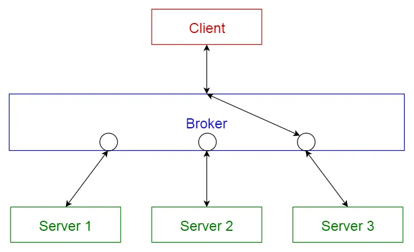

# PATRONES DE ARQUITECTURA
> [!NOTE]
> 👍 Un **patron arquitectonico** es una solucion general y reutilizable a un problema comun en la arquitectura de sofware dentro de un contexto dado. Los patrones arquitectura son la habilidad de organizacion a nivel de carpeta dentro del proyecto de sofware.

**PATRONES ARQUITECTONICOS MAS CONOCIDOS😲:**

1. PATRON DE CAPAS
2. PATRON CLIENTE-SERVIDOR
3. PATRON MAESTRO-ESCLAVO
4. `PATRON FILTRO DE TUBERIA`
5. PATRON INTERMEDIARIO
6. PATRON DE IGUAL A IGUAL
7. PATRON DE BUS EVENTO
8. MODELO-VISTA-CONTROLADOR
9. ARQUITECTURA LIMPIA
10. ARQUITECTURA HEXEGONAL

## PATRON INTERMEDIARIO O PATRON DEL AGENTE (Mediador (Broker pattern))
> [!CONCEPTO]
Este patrón se utiliza en sistemas distribuidos con componentes desacoplados para facilitar la comunicación entre ellos. Un intermediario coordina la comunicación, donde los servidores publican sus servicios y los clientes solicitan servicios al intermediario, quien redirige la solicitud al servidor correspondiente desde su registro.

## El Broker:
Es un patrón de diseño que actúa como intermediario entre diferentes componentes de un sistema distribuido. Su principal función es facilitar la comunicación entre estos componentes, permitiendo que interactuen de manera desacoplada a través de invocaciones de servicios remotos.

El Broker es el intermediario 📱 entre el cliente 💁 y el servidor🗄️,
Cuando el cliente💁 necesita➡️ un servicio del servidor🗄️, envia una peticion al Broker📱, que a su vez le enviara al servidor🗄️. El servidor realiza la funcionalidad correspondiente y envía la respuesta (o excepción) de vuelta al broker, que se la devuelve al cliente.
Si el servidor especificado es mantenido por otro broker, el `broker local (agente que actúa como corredor o intermediario entre un comprador y un vendedor)` encuentra una ruta al broker remoto y le envía la solicitud.

## PROBLEMA:
Construir un sistema de software usando un sistema distribuido con componentes desacoplados aporta una flexibilidad al mantenimiento y al cambio, pero para ello es necesario un sistema de comunicación. Si los componentes manejaran la comunicación por sí mismos, el sistema se enfrentaría a diversas dependencias y limitaciones.
Se necesitan servicios para añadir, quitar, intercambiar, activar y localizar componentes. Las aplicaciones que utilizan estos servicios no deben depender de los detalles específicos del sistema a fin de garantizar interoperabilidad, aún en una red heterogénea.

## SOLUCIÓN:
Ofrece una solución al problema anterior actuando como «mediado» entre los diferentes componentes. Así, una aplicación puede acceder a los servicios distribuidos enviando mensajes al objeto apropiado, en vez de enfocarse en la comunicación entre procesos de bajo nivel. También facilita el cambio y la adición de objetos y funciones.
  
## Cliente:
Los clientes son aplicaciondes que accesan a servideores de modelos dinamicos, esto quiere decir que el servidor puede actuar como el cliente, accediendo a otros servidores. Se pueden reralizar cambios mientras el sistema se este ejecutando.

## Proxies:
Podemos distinguir dos tipos de proxies:
- `Proxies del cliente`
- `Proxies del servidor`
  
## Puentes:
Son un componente opcional utilizado para esconder detalles de implementación cuando dos brokers interoperan.

## ALGUNAS VARIANTES
- `Sistema de comunicación directa:`
En esta variante los clientes pueden comunicarse directamente con los servidores. El cliente puede establecer un enlace directo al servidor solicitado.

- `Sistemas de Paso de Mensajes:`
Esta variante es apropiada para sistemas que se enfocan en la transmisión de datos (mediante un mensaje).

- `Sistemas Callback (función que se pasa a otra función como un argumento):`
En vez de implementar un modelo de comunicación activa donde los clientes producen solicitudes y los servidores las consumen, se puede utilizar un modelo reactivo que se maneja por eventos sin hacer distinción entre clientes y servidores. Cuando un evento llega, el broker invoca el método callback del componente registrado para reaccionar ante ese evento, cuya ejecución, a su vez puede generar nuevos eventos causando que el broker dispare nuevas invocaciones de métodos callback.

